# Cheap Tester (Raspberry Pi Pico / Pico2)

Raspberry Pi Pico / Pico2 を使った **簡易 テスター** です。  
抵抗値と電圧を測定して、I²C 接続のキャラクタ LCD に表示します。

---

## 機能概要

- **抵抗測定モード（RES モード）**
  - 自動レンジ  
    1 kΩ / 10 kΩ / 100 kΩ / 1 MΩ のリファレンス抵抗を切り替えて測定
  - kΩ 表記・小数点付きで LCD 表示
  - 低抵抗（例：80 Ω 以下）のときにブザー ON（導通チェッカ風）

- **電圧測定モード（VOLT モード）**
  - 固定分圧（約 1:11）で電圧を測定
  - 表示形式は `±xx.xx V`
  - 正方向の電圧測定（理論上 + 約 22 V 程度まで）※mcp3425は正負測れるADCでソフトもそうなってますが、回路は正電圧のみ測定用になってます。

- **その他**
  - モード切り替え用のロッカースイッチ（トグル動作）1 個（RES 側: `SW_RES_GPIO`、VOL 側: `SW_VOL_GPIO`）
  - 測定レンジ切替・MOSFET 駆動
  - ステータス確認用 LED（Pico / Pico2 のオンボード LED）

---

## ハードウェア構成

### 必要な部品（目安）

- Raspberry Pi Pico2 本体
- I²C キャラクタ LCD  
  - AQM0802A + I²C ブリッジ（アドレス: `0x3E`）を想定
- ADC（高分解能）
  - MCP3425（アドレス: `0x68`）
- リファレンス抵抗
  - 1 kΩ
  - 10 kΩ
  - 100 kΩ
  - 1 MΩ  
  （値は `measure.c` の計算式に合わせています）
- Nch MOSFETや光MOSFET数個（レンジ切替・測定モード切替用）
- 圧電ブザー
- ロッカースイッチ 1 個（RES / VOL モード切り替え、トグル動作・プルアップ入力）
- 必要な配線・基板など

### GPIO 割り当て

`Inc/config.h` で GPIO 割り当てを定義しています（抜粋）。

```c
/* --- GPIO ------------------------------------------------------------- */
#define Q1_GPIO      11
#define Q2_GPIO      12
#define Q3_GPIO      13
#define Q4_GPIO      14
#define Q5_GPIO      16
#define Q6_GPIO      20
#define Q7_GPIO      15
#define Q8_GPIO      22

/* Measurement range aliases */
#define R1_GPIO      Q1_GPIO
#define R2_GPIO      Q2_GPIO
#define R3_GPIO      Q3_GPIO
#define R4_GPIO      Q4_GPIO

#define BUZZER_GPIO   5
#define LED_GPIO     25
#define SW_RES_GPIO  17
#define SW_VOL_GPIO  18

/* --- I²C -------------------------------------------------------------- */
#define I2C_PORT  i2c1
#define PIN_SDA   26
#define PIN_SCL   27
#define LCD_ADDR  0x3E    /* AQM0802A */
#define ADC_ADDR  0x68    /* MCP3425  */
```

| 機能              | シンボル        | GPIO |
|-------------------|-----------------|------|
| Q1 / リファレンス抵抗1 | `Q1_GPIO` / `R1_GPIO` | 11   |
| Q2 / リファレンス抵抗2・電圧固定分圧 | `Q2_GPIO` / `R2_GPIO` | 12   |
| Q3 / リファレンス抵抗3 | `Q3_GPIO` / `R3_GPIO` | 13   |
| Q4 / リファレンス抵抗4 | `Q4_GPIO` / `R4_GPIO` | 14   |
| Q5 制御               | `Q5_GPIO`             | 16   |
| Q6 制御               | `Q6_GPIO`             | 20   |
| Q7 制御               | `Q7_GPIO`             | 15   |
| Q8 制御               | `Q8_GPIO`             | 22   |
| ブザー            | `BUZZER_GPIO`   | 5    |
| ステータス LED    | `LED_GPIO`      | 25   |
| ロッカースイッチ RES 側 | `SW_RES_GPIO`   | 17   |
| ロッカースイッチ VOL 側 | `SW_VOL_GPIO`   | 18   |
| I²C SDA           | `PIN_SDA`       | 26   |
| I²C SCL           | `PIN_SCL`       | 27   |
| LCD アドレス      | `LCD_ADDR`      | 0x3E |
| ADC アドレス      | `ADC_ADDR`      | 0x68 |

---

## 状態遷移図

ロッカースイッチの位置に応じて、抵抗測定モードと電圧測定モードを切り替えます。
`SW_RES_GPIO` / `SW_VOL_GPIO` はプルアップ入力のため、スイッチで選択された側が Low になります。

```mermaid
stateDiagram-v2
    [*] --> Boot: 電源投入 / リセット
    Boot --> Init: GPIO・I²C・LCD・ADC 初期化
    Init --> SelectMode: ロッカースイッチ状態確認

    SelectMode --> RES: SW_VOL_GPIO == High
    SelectMode --> VOLT: SW_VOL_GPIO == Low

    state "抵抗測定モード" as RES
    note right of RES
      自動レンジ切替
      抵抗値をLCD表示
      80Ω以下でブザーON
    end note

    state "電圧測定モード" as VOLT
    note right of VOLT
      固定分圧経路を選択
      電圧値をLCD表示
      ブザーOFF
    end note

    RES --> VOLT: VOL側へ切替 / LED点滅・LCDクリア
    VOLT --> RES: RES側へ切替 / LED点滅・LCDクリア

    RES --> RES: RES側のまま測定更新
    VOLT --> VOLT: VOL側のまま測定更新
```



---

## フォルダ構成

```text
Cheap_Tester/
├── readme.md                 # このファイル
├── README/                   # PDF や図などの資料
│   ├── CheapTester_BOM.pdf
│   ├── CheapTester_Flow.pdf
│   └── schematic_CheapTester.pdf
├── CMakeLists.txt
├── pico_sdk_import.cmake
├── .gitignore
├── .vscode/                  # VS Code 用設定
├── Inc/                      # ヘッダファイル
│   ├── config.h
│   ├── hw_adc.h
│   ├── hw_gpio.h
│   ├── hw_i2c.h
│   ├── hw_lcd.h
│   └── measure.h
├── Src/                      # アプリケーション本体（ビルド対象）
│   ├── main.c
│   ├── measure.c
│   ├── hw_adc.c
│   ├── hw_gpio.c
│   ├── hw_i2c.c
│   └── hw_lcd.c
```

---

## 簡単プログラム書き込み

ビルド済みの `.uf2` ファイルを Pico2 に書き込むだけなら、専用ツールは不要です。
Pico2 を USB メモリのように認識させて、ファイルをコピーします。

1. Pico2 の **BOOTSEL（BOOT）ボタン** を押したまま、USB ケーブルで PC に接続します。
2. PC 側で Pico2 が USB ドライブとして認識され、エクスプローラーが開きます。
3. 次のファイルを、開いた Pico2 のドライブへドラッグ＆ドロップします。

   ```text
   Cheap_Tester\build\Cheap_Tester.uf2
   ```

4. コピーが終わると Pico2 が自動的に再起動し、書き込み完了です。
